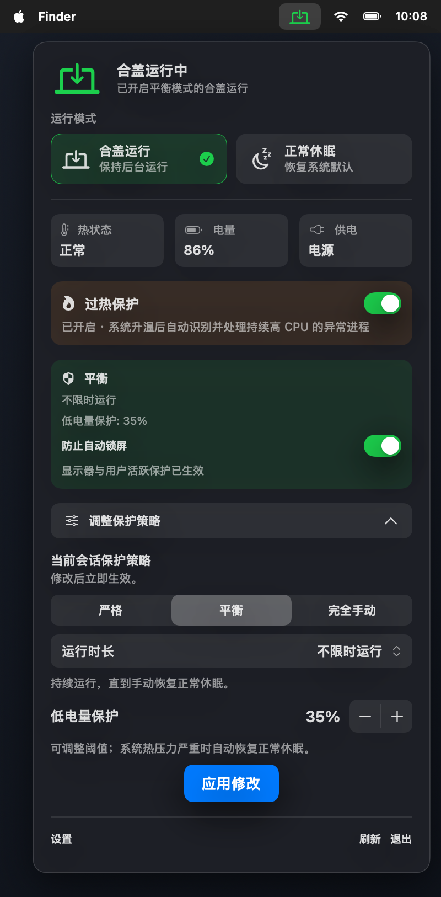
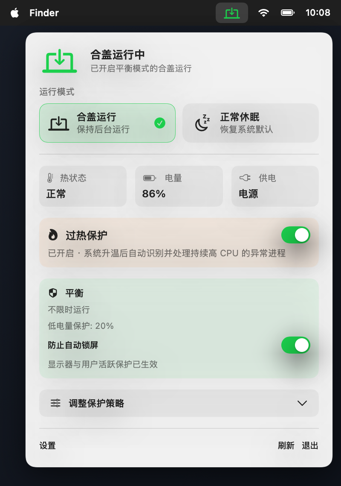
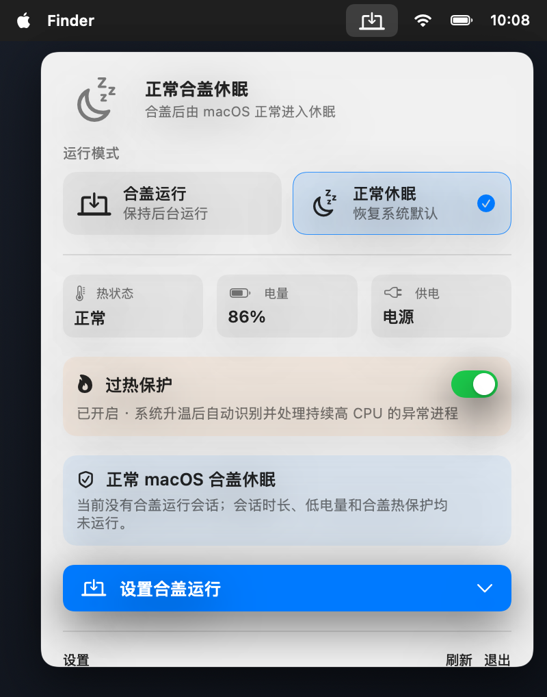
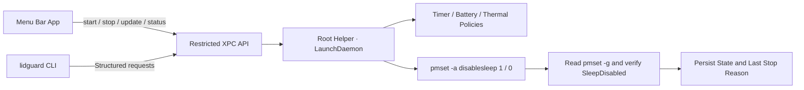

<div align="center">

[简体中文](README.zh-CN.md) · **English**

# LidGuard

**Close your Mac before heading out without interrupting Codex, other local agents, or remote access. LidGuard keeps them running under configurable safeguards.**

[](https://github.com/aermin/LidGuard)
[](https://github.com/aermin/LidGuard)
[](https://github.com/aermin/LidGuard)
[](https://github.com/aermin/LidGuard)

Lightweight menu bar app · Restricted root helper · CLI · No display takeover · No agent hooks

</div>

You may need to close your Mac and put it in a sleeve or bag while **Codex, another local agent, a download, or a build is still running**. You may also leave the Mac at home or at your desk and continue viewing and controlling it from your phone. By default, macOS sleeps when the lid is closed, stopping those tasks and remote connections.

LidGuard lets you choose what happens after the lid closes. It can keep the Mac running when needed, then automatically restore normal sleep when a timer, low-battery threshold, or system thermal safeguard is triggered. It exposes two clear modes:

- **Keep Running with Lid Closed**: agents, tasks, and remote connections continue after the lid closes, under the safeguards you select.
- **Normal Lid Sleep**: restores the default macOS behavior so the Mac sleeps normally when closed.

LidGuard only manages whether the Mac keeps running with the lid closed. It does not take over the display or alter unrelated sleep settings.

> [!WARNING]
> Running a Mac inside a sleeve, backpack, or other enclosed space can trap heat. LidGuard provides thermal safeguards, but it cannot eliminate physical cooling risks. Manual unlimited sessions require an additional confirmation.

## Quick Start

### Daily Use

1. Click the LidGuard icon in the menu bar.
2. Select **Keep Running with Lid Closed (`合盖运行`)**, choose a protection profile and duration, then click **Start (`开始合盖运行`)**.
3. When continuous operation is no longer needed, select **Normal Lid Sleep (`正常休眠`)** to restore the default macOS lid behavior.

While a session is active, you can view its remaining time, battery level, power source, and system thermal state, or adjust its safeguards.

### Requirements

- Apple Silicon Mac
- macOS 13 or later
- Xcode Command Line Tools / Swift 5.10
- The current local v1 uses ad-hoc signing and is not a distributable installer

### Build, Test, and Install

```bash
git clone https://github.com/aermin/LidGuard.git
cd LidGuard

make test
make package
make install
```

`make install` will:

1. Build `dist/LidGuard.app`.
2. Request administrator authorization once.
3. Install the restricted helper, LaunchDaemon, and `/usr/local/bin/lidguard`.
4. Open the LidGuard menu bar app.

Switching modes during normal use should not request administrator authorization again.

Local v1 builds use ad-hoc signatures. Rebuilding the app generates a new code hash, so updating a development build with `make install` requires authorization again. LidGuard detects this signature mismatch and displays **Reauthorize Helper (`重新授权 Helper`)** instead of incorrectly reporting the helper as missing.

## Interface

<p align="center">
  
</p>

<p align="center"><sub>The expanded panel keeps mode switching, device status, the current session, protection profile, duration, and low-battery threshold in one menu.</sub></p>

The low-battery threshold is configurable directly in the protection panel. Strict mode uses a fixed 30% threshold, Balanced mode supports 10%-50%, and Manual mode exposes the same threshold control after low-battery protection is enabled.

<table>
  <tr>
    <td align="center"><strong>Keep Running with Lid Closed</strong></td>
    <td align="center"><strong>Normal Lid Sleep</strong></td>
  </tr>
  <tr>
    <td></td>
    <td></td>
  </tr>
  <tr>
    <td>Shows the current profile, duration, low-battery threshold, thermal state, and power source.</td>
    <td>Hides irrelevant protection countdowns and expands session configuration only when needed.</td>
  </tr>
</table>

## Protection Profiles

| Profile | Duration | Low-battery safeguard | Thermal safeguard | Best for |
| --- | --- | --- | --- | --- |
| **Strict** | Required, 30 minutes to 8 hours | Fixed at 30% | Restore sleep at `serious` or `critical` | Short absences, safety first |
| **Balanced** | Preset, custom, or unlimited | 20% by default, adjustable from 10%-50% | Restore sleep at `serious` or `critical` | Everyday remote access and agent tasks |
| **Manual** | Preset, custom, or unlimited | Off by default, optional | Warn at `serious`; always restore sleep at `critical` | Users explicitly accepting more risk |

Custom sessions can run for up to 7 days. LidGuard sends a notification 5 minutes before expiration. Low-battery protection triggers only while running on battery and not charging.

## CLI

### Install the CLI

The CLI does not require a separate installation. Complete the source installation above:

```bash
git clone https://github.com/aermin/LidGuard.git
cd LidGuard
make install
```

`make install` installs the menu bar app, restricted helper, and CLI together. The CLI is placed at:

```text
/usr/local/bin/lidguard
```

Verify the installation with:

```bash
command -v lidguard
lidguard doctor
lidguard status
```

If the shell reports `command not found`, try `/usr/local/bin/lidguard doctor` directly. If that works, make sure `/usr/local/bin` is included in your shell's `PATH`.

> [!NOTE]
> Do not copy only the CLI binary from the build directory. The CLI must be installed together with the helper so the installation process can register its code-signing requirement. Run `make install` again when updating a source build.

### Usage

```bash
# Show the current mode, power source, thermal state, and safeguards
lidguard status
lidguard status --json

# Run a Balanced session for 4 hours
lidguard start --profile balanced --for 4h

# Run a Strict session until a specific time
lidguard start --profile strict --until 2026-08-10T23:30:00+08:00

# Run a Manual unlimited session with explicit risk confirmation
lidguard start --profile manual --unlimited --confirm-risk

# Extend the current deadline by 2 hours
lidguard extend --for 2h

# Immediately restore normal lid sleep
lidguard stop

# Check the helper, protocol, CLI, and SleepDisabled state
lidguard doctor
```

LidGuard does not install Codex hooks. Agents must invoke the CLI explicitly, so starting or finishing a task never changes the entire Mac's power state automatically.

## Why LidGuard

General-purpose keep-awake tools often affect the display, idle sleep, or other power behavior at the same time. Remote-control and agent workflows need a narrower switch with clear recovery behavior:

| Goal | LidGuard behavior |
| --- | --- |
| Keep tasks running after the lid closes | Changes only the system `SleepDisabled` state |
| Keep remote desktop visible and controllable | Creates no display sleep assertion or virtual display |
| Preserve safeguards after the app quits | The LaunchDaemon helper persists timers and policies |
| Avoid entering an admin password every time | Authorize the helper once, then use restricted XPC calls |
| Recover from low battery or overheating | Restore `disablesleep=0` and record the stop reason |
| Handle external power-state changes | Do not fight them repeatedly; end the session or report external management |

## Security Boundaries

- The helper runs as root but exposes only four structured operation types.
- The helper validates the caller UID and the code-signing requirement recorded during installation.
- Sessions, deadlines, and safeguards survive app, CLI, or helper restarts.
- **Restore Normal Sleep** changes only `disablesleep=0`; it does not overwrite other `pmset` settings.
- If another process disables `SleepDisabled`, LidGuard ends the current session instead of repeatedly enabling it again.
- If another process enables `SleepDisabled`, the UI reports that the state is not managed by LidGuard.
- Uninstalling the helper restores normal sleep first.

## Verification

Automated tests cover the policy matrix, time parsing, low-battery behavior, all four thermal states, state recovery, external overrides, and `pmset` readback failures. Tests use fake power controllers and sensors, so they do not modify the real system power state.

```text
Tests: 16 passed, 0 failed
```

Verified on the current test machine:

- During an active session, vivo remote control remains visible and usable after the lid closes, and agents continue running.
- In Normal Lid Sleep mode, remote control becomes unusable after the lid closes and macOS returns to its default sleep behavior.
- The helper continues enforcing timers, low-battery safeguards, and thermal safeguards after the app quits.
- LidGuard adds no `caffeinate` or display sleep assertions.

## Uninstall

In the app settings, select **Restore Sleep and Uninstall Helper (`恢复休眠并卸载 Helper`)**. LidGuard first restores `disablesleep=0`, then removes the LaunchDaemon, helper, and CLI. The app and source code remain in place.

## Known Limitations

> [!IMPORTANT]
> Apple does not publicly document `pmset disablesleep` as a stable interface. Re-test lid-close, wake, and remote-control behavior after macOS upgrades.

- End-to-end testing has currently been completed only on an Apple Silicon Mac running macOS 15.6.1.
- Local v1 uses ad-hoc signing and has not been prepared for Developer ID distribution or notarization.
- LidGuard uses the system levels from `ProcessInfo.thermalState`; it does not read private SMC temperature values.
- LidGuard cannot guarantee that every remote-control application will keep producing video while the lid is closed.
- The absence of a reported `critical` thermal state does not mean running inside a sleeve or backpack is safe.

## Project Structure

```text
LidGuardCore       Shared models, policies, time parsing, and XPC protocol
LidGuardApp        SwiftUI menu bar app and settings
LidGuardHelper     Privileged helper entry point
LidGuardHelperKit  Power control, sensors, state persistence, and policy engine
LidGuardCLI        lidguard command-line interface
LidGuardTests      Side-effect-free policy and helper tests
```

## How It Works



The helper accepts only the fixed `start`, `stop`, `update`, and `status` operations. It does not accept arbitrary command strings or file paths. After every change, it reads `pmset -g` to verify the result and never falsely reports an active session after a failed update.

Internally, **Keep Running with Lid Closed** and **Normal Lid Sleep** execute `pmset -a disablesleep 1` and `pmset -a disablesleep 0`, respectively. LidGuard creates no virtual display, performs no screen capture, changes neither `sleep` nor `displaysleep`, and adds no extra sleep assertion through `caffeinate`.
