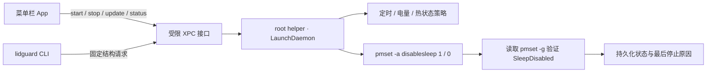

<div align="center">

# LidGuard · 合盖守护

**让 Mac 在合盖时按你的规则继续运行，并在定时、低电量或过热时自动恢复休眠。**

[](https://github.com/aermin/LidGuard)
[](https://github.com/aermin/LidGuard)
[](https://github.com/aermin/LidGuard)
[](https://github.com/aermin/LidGuard)

轻量菜单栏 App · 受限 root helper · CLI · 不接管显示器 · 不安装 Agent hooks

</div>

LidGuard 面向需要让 **Codex、下载任务、构建任务或远程控制软件** 在 Mac 合盖后继续工作的场景。它提供两个明确状态：

- **合盖运行**：设置 `pmset -a disablesleep 1`，并由 helper 持续执行保护策略。
- **正常休眠**：设置 `pmset -a disablesleep 0`，把睡眠控制权交还 macOS。

它不会创建虚拟显示器、捕获屏幕、修改 `sleep` / `displaysleep`，也不会通过 `caffeinate` 添加额外睡眠断言。

> [!WARNING]
> 在保护套、背包或其他密闭空间内运行 Mac 可能积热。LidGuard 提供热状态保护，但不能消除物理散热风险；完全手动且不限时运行需要二次确认。

## 界面

<table>
  <tr>
    <td align="center"><strong>合盖运行</strong></td>
    <td align="center"><strong>正常合盖休眠</strong></td>
  </tr>
  <tr>
    <td></td>
    <td></td>
  </tr>
  <tr>
    <td>显示当前策略、时长、低电量阈值、热状态和供电方式。</td>
    <td>不显示无意义的保护倒计时，需要时再展开合盖运行配置。</td>
  </tr>
</table>

## 为什么做 LidGuard

通用防休眠工具通常同时影响显示器、系统空闲休眠或其他电源行为。对于远程控制和 Agent 场景，真正需要的是一个边界清晰、容易恢复的开关：

| 目标 | LidGuard 的处理 |
| --- | --- |
| 合盖后任务继续执行 | 只切换系统 `SleepDisabled` 状态 |
| 远程桌面继续可见、可控 | 不创建显示器防休眠断言或虚拟显示器 |
| App 退出后保护仍生效 | 定时和保护策略由 LaunchDaemon helper 持久执行 |
| 不想每次输入管理员密码 | 首次安装 helper 时授权一次，之后通过受限 XPC 调用 |
| 发生低电量或过热 | 自动恢复 `disablesleep=0` 并记录停止原因 |
| 外部工具修改电源状态 | 不反复争抢；结束会话或标记为外部管理状态 |

## 三种保护策略

| 策略 | 时长 | 低电量保护 | 热状态保护 | 适合场景 |
| --- | --- | --- | --- | --- |
| **严格** | 必须设置 30 分钟至 8 小时 | 固定 30% | `serious` / `critical` 自动恢复 | 临时离开、风险优先 |
| **平衡** | 预设、自定义或不限时 | 默认 20%，可调 10%–50% | `serious` / `critical` 自动恢复 | 日常远控和 Agent 任务 |
| **完全手动** | 预设、自定义或不限时 | 默认关闭，可手动启用 | `serious` 警告，`critical` 强制恢复 | 用户明确接管风险 |

定时任务最长 7 天；到期前 5 分钟发送通知。低电量保护只在电池供电且未充电时触发。

## 工作原理



Helper 只接受固定的 `start`、`stop`、`update` 和 `status` 操作，不接受任意命令字符串或文件路径。每次修改后都会读取 `pmset -g` 验证结果，失败时不会虚假显示“合盖运行中”。

## 快速开始

### 环境

- Apple Silicon Mac
- macOS 13 或更高版本
- Xcode Command Line Tools / Swift 5.10
- 当前本机版本仅使用临时签名，不是可分发安装包

### 构建、测试与安装

```bash
git clone https://github.com/aermin/LidGuard.git
cd LidGuard

make test
make package
make install
```

`make install` 会：

1. 构建 `dist/LidGuard.app`。
2. 请求一次管理员授权。
3. 安装受限 helper、LaunchDaemon 和 `/usr/local/bin/lidguard`。
4. 打开 LidGuard 菜单栏 App。

安装后，日常切换模式不应再次要求管理员授权。

## CLI

```bash
# 查看当前模式、供电、热状态和保护策略
lidguard status
lidguard status --json

# 平衡模式运行 4 小时
lidguard start --profile balanced --for 4h

# 严格模式运行至指定时间
lidguard start --profile strict --until 2026-08-10T23:30:00+08:00

# 完全手动、不限时，需要显式确认风险
lidguard start --profile manual --unlimited --confirm-risk

# 在当前结束时间基础上延长 2 小时
lidguard extend --for 2h

# 立即恢复正常合盖休眠
lidguard stop

# 检查 helper、协议、CLI 和 SleepDisabled
lidguard doctor
```

LidGuard 不安装 Codex hooks。Agent 需要显式调用 CLI，不会因为任务开始或结束自动改变整台 Mac 的电源状态。

## 安全边界

- Helper 运行于 root，但只暴露四类结构化操作。
- Helper 校验调用者 UID 和安装时记录的代码签名要求。
- App、CLI 或 helper 重启后，会话、截止时间和保护策略仍可恢复。
- “恢复正常休眠”只执行 `disablesleep=0`，不会覆盖其他 `pmset` 设置。
- 外部程序关闭 `SleepDisabled` 时，LidGuard 结束当前会话，不会循环重开。
- 外部程序开启 `SleepDisabled` 时，界面标记为非 LidGuard 管理状态。
- 卸载 helper 前会先恢复正常休眠。

## 验证

自动测试覆盖策略矩阵、定时解析、低电量、四级热状态、状态恢复、外部覆盖和 `pmset` 回读错误，测试使用假的电源控制器与传感器，不会在测试期间真实修改系统电源状态。

```text
Tests: 14 passed, 0 failed
```

当前实机已验证：

- 合盖运行时，vivo 远控保持可见、可操作，Agent 继续执行。
- 正常休眠时，合盖后远控不可操作，系统恢复默认睡眠行为。
- App 退出后，helper 仍能执行定时、低电量和热状态保护。
- LidGuard 不新增 `caffeinate` 或显示器防休眠断言。

## 卸载

在 App 设置中选择 **“恢复休眠并卸载 Helper”**。该操作会先恢复 `disablesleep=0`，再删除 LaunchDaemon、helper 和 CLI；App 和源码会保留。

## 已知限制

> [!IMPORTANT]
> `pmset disablesleep` 没有 Apple 公开文档提供稳定性保证。系统升级后，应重新验证合盖、唤醒和远程控制行为。

- 当前只在 Apple Silicon、macOS 15.6.1 上完成实机验收。
- 本机 v1 使用临时签名，尚未完成 Developer ID 签名、公证和公开分发。
- LidGuard 使用 `ProcessInfo.thermalState` 的系统等级，不读取私有 SMC 摄氏温度。
- LidGuard 不能保证所有远程控制软件都能在合盖状态下保持图像输出。
- 即使软件未报告 `critical`，也不代表保护套或背包内运行是安全的。

## 项目结构

```text
LidGuardCore       共享模型、策略、时间解析和 XPC 协议
LidGuardApp        SwiftUI 菜单栏 App 与设置页
LidGuardHelper     特权 helper 入口
LidGuardHelperKit  电源控制、传感器、状态持久化和策略引擎
LidGuardCLI        lidguard 命令行工具
LidGuardTests      无副作用的策略与 helper 测试
```
