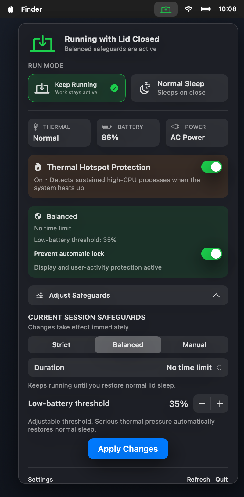
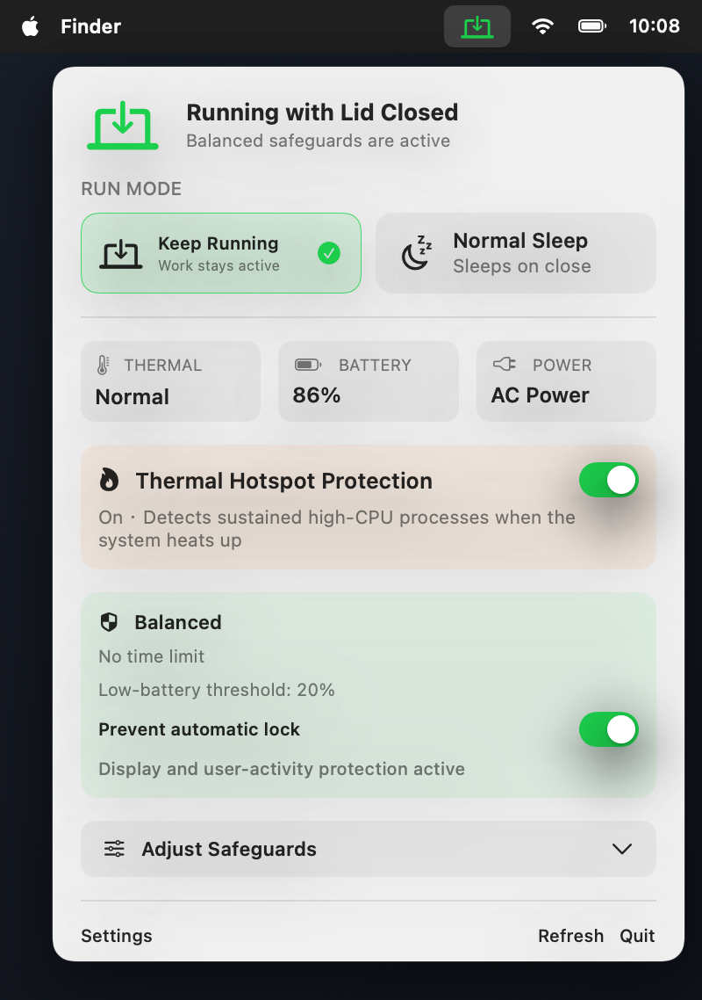
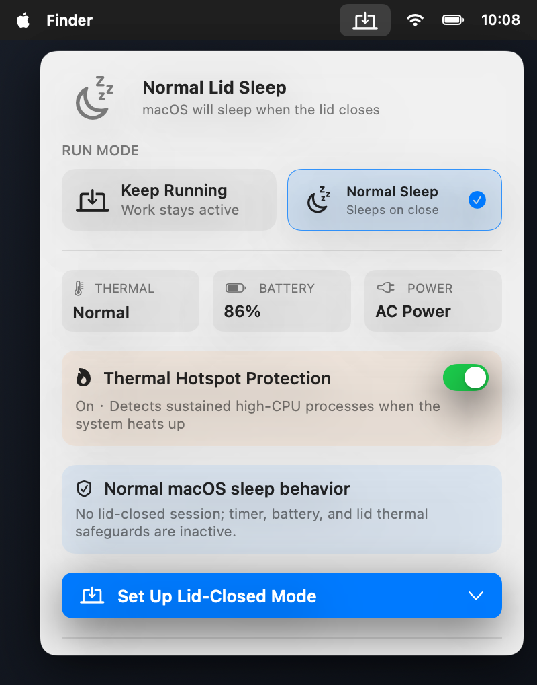
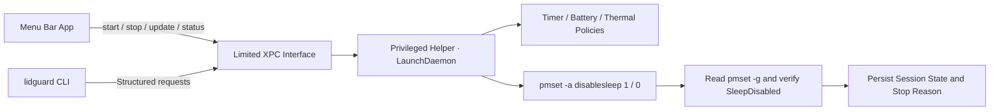

<div align="center">

[简体中文](README.zh-CN.md) · **English**

# LidGuard

**Keep your Mac running with the lid closed, so Codex tasks and remote access from your phone can continue.**

[](https://github.com/aermin/LidGuard)
[](https://github.com/aermin/LidGuard)
[](https://github.com/aermin/LidGuard)
[](https://github.com/aermin/LidGuard)

Menu bar app · Time, battery, and thermal safeguards · CLI · No virtual display · No agent hooks

</div>

By default, macOS sleeps when the lid closes, interrupting Codex tasks, builds, downloads, and remote access. LidGuard gives you two clear modes and can automatically restore normal sleep when a timer expires, the battery runs low, or macOS reports serious thermal pressure.

- **Keep Running with Lid Closed**: keeps Codex tasks and other background work running, while supported remote-control software remains available.
- **Normal Lid Sleep**: restores the default macOS behavior, so the Mac sleeps when the lid closes.

LidGuard changes only lid-close sleep behavior. It does not create a virtual display, capture the screen, keep the display awake, or change unrelated sleep settings.

> [!WARNING]
> Running a MacBook inside a sleeve, backpack, or other enclosed space can trap heat. LidGuard can react to thermal pressure reported by macOS, but it cannot guarantee safe temperatures or airflow. Manual sessions with no time limit require an additional confirmation.

## Quick Start

### Install the Preview DMG

1. Download `LidGuard-1.0.0-preview.1-arm64.dmg` from [GitHub Releases](https://github.com/aermin/LidGuard/releases).
2. Open the DMG and drag **LidGuard** into **Applications**.
3. Try to open LidGuard from Applications. macOS may block it because the preview uses an ad-hoc signature.
4. Open **System Settings → Privacy & Security**, scroll to **Security**, click **Open Anyway**, authenticate, and confirm **Open**.
5. In LidGuard, click **Install Helper (`安装 Helper`)** and approve the one-time administrator prompt.

Installing the helper also installs the LaunchDaemon and the `lidguard` CLI. After this initial authorization, switching between Keep Running and Normal Sleep does not require an administrator password.

### Daily Use

1. Click the LidGuard icon in the menu bar.
2. Select **Keep Running (`合盖运行`)**, choose a protection profile and duration, then click **Start (`开始合盖运行`)**.
3. When you no longer need the Mac to stay running, select **Normal Sleep (`正常休眠`)** to restore the default macOS behavior.

While a session is active, you can check the remaining time, battery level, power source, and thermal state, or adjust the current safeguards.

### Requirements

- Apple Silicon Mac
- macOS 13 or later

### Build from Source

Source builds require Xcode Command Line Tools and Swift 5.10.

```bash
git clone https://github.com/aermin/LidGuard.git
cd LidGuard

make test
make package
make install
```

`make install` will:

1. Build `dist/LidGuard.app`.
2. Prompt once for administrator authorization.
3. Install the privileged helper, LaunchDaemon, and `/usr/local/bin/lidguard`.
4. Open the LidGuard menu bar app.

After the initial installation, switching modes does not require administrator authorization.

Development builds use ad-hoc signatures, so each rebuild changes the app's code signature. Running `make install` to update a development build will therefore request administrator authorization again. If the installed helper no longer recognizes the rebuilt app, LidGuard displays **Reauthorize Helper (`重新授权 Helper`)** instead of reporting the helper as missing.

To create a local test DMG:

```bash
make dmg
```

The output is `dist/LidGuard-1.0.0-arm64.dmg`. Local test DMGs use ad-hoc signing.

## Interface

<p align="center">
  
</p>

<p align="center"><sub>The expanded panel puts mode selection, device status, session details, safeguards, duration, and the low-battery threshold in one menu.</sub></p>

The low-battery threshold can be changed directly in the safeguards panel. Strict uses a fixed 30% threshold, Balanced allows 10%–50%, and Manual exposes the same control when low-battery protection is enabled.

<table>
  <tr>
    <td align="center"><strong>Keep Running with Lid Closed</strong></td>
    <td align="center"><strong>Normal Lid Sleep</strong></td>
  </tr>
  <tr>
    <td></td>
    <td></td>
  </tr>
  <tr>
    <td>Shows the current profile, duration, low-battery threshold, thermal state, and power source.</td>
    <td>Shows a clean idle state and reveals session setup only when requested.</td>
  </tr>
</table>

## Protection Profiles

| Profile | Duration | Low-battery safeguard | Thermal safeguard | Best for |
| --- | --- | --- | --- | --- |
| **Strict** | Required: 30 minutes to 8 hours | Fixed at 30% | Restores normal sleep at `serious` or `critical` | Short absences; safety first |
| **Balanced** | Preset, custom, or no time limit | 20% by default; adjustable from 10%–50% | Restores normal sleep at `serious` or `critical` | Everyday remote access and agent tasks |
| **Manual** | Preset, custom, or no time limit | Off by default; optional | Warns at `serious`; always restores sleep at `critical` | Advanced users who want direct control |

Timed sessions can run for up to 7 days. LidGuard sends a notification 5 minutes before a timed session ends. Low-battery protection applies only while the Mac is running on battery and not charging.

## CLI

### Install the CLI

The CLI is installed automatically when you click **Install Helper** in the app. Source builds can install the same components with:

```bash
git clone https://github.com/aermin/LidGuard.git
cd LidGuard
make install
```

`make install` installs the menu bar app, privileged helper, and CLI together. The CLI is placed at:

```text
/usr/local/bin/lidguard
```

Verify the installation with:

```bash
command -v lidguard
lidguard doctor
lidguard status
```

If the shell reports `command not found`, try `/usr/local/bin/lidguard doctor` directly. If that works, make sure `/usr/local/bin` is included in your shell's `PATH`.

> [!NOTE]
> Do not copy the CLI binary by itself from the build directory. It must be installed with the helper so the installer can register the CLI's code-signing requirement. Run `make install` again when updating a source build.

### Usage

```bash
# Show the current mode, power source, thermal state, and safeguards
lidguard status
lidguard status --json

# Start a Balanced session for 4 hours
lidguard start --profile balanced --for 4h

# Start a Strict session that ends at a specific time
lidguard start --profile strict --until 2026-08-10T23:30:00+08:00

# Start a Manual session with no time limit and confirm the risk
lidguard start --profile manual --unlimited --confirm-risk

# Extend the current deadline by 2 hours
lidguard extend --for 2h

# Immediately restore normal lid sleep
lidguard stop

# Check the helper, protocol, CLI, and SleepDisabled state
lidguard doctor
```

LidGuard intentionally does not install Codex hooks. Agents can call the CLI explicitly, but starting or finishing a task will never change the Mac's system-wide sleep behavior automatically.

## Why LidGuard

General-purpose keep-awake tools often prevent display sleep, idle sleep, or both. Remote-control and agent workflows benefit from narrower control with predictable recovery behavior:

| Goal | LidGuard behavior |
| --- | --- |
| Keep tasks running after the lid closes | Changes only the system `SleepDisabled` state |
| Avoid interfering with remote desktop output | Creates no display-sleep assertion or virtual display |
| Keep safeguards active after the app quits | The LaunchDaemon helper persists the session and its policies |
| Avoid entering an admin password every time | Authorize the helper once, then use the limited XPC interface |
| Recover from low battery or thermal pressure | Restores `disablesleep=0` and records the reason |
| Respect changes made by other tools | Does not repeatedly override them; ends the session or reports an externally managed state |

## Security Boundaries

- The helper runs as root but exposes only a fixed set of structured operations.
- The helper validates the caller's UID and the code-signing requirement recorded during installation.
- Session state, deadlines, and safeguards survive app, CLI, and helper restarts.
- **Restore Normal Sleep** changes only `disablesleep=0`; it does not overwrite other `pmset` settings.
- If another process clears `SleepDisabled`, LidGuard ends the current session instead of repeatedly setting it again.
- If another process sets `SleepDisabled`, the UI reports that LidGuard does not manage the current state.
- Uninstalling the helper restores normal sleep first.

## Verification

Automated tests cover the policy matrix, time parsing, low-battery behavior, all four macOS thermal states, state recovery, external overrides, and `pmset` verification failures. The test suite uses simulated power controllers and sensors, so it does not change the real system power state.

```text
Tests: 16 passed, 0 failed
```

Verified on the development Mac:

- During an active session, vivo remote control remains visible and usable after the lid closes, while coding agents continue running.
- In Normal Sleep mode, remote control becomes unusable after the lid closes and macOS follows its default sleep behavior.
- The helper continues enforcing timers, low-battery safeguards, and thermal safeguards after the app quits.
- LidGuard starts no `caffeinate` process and creates no display-sleep assertions.

## Uninstall

In the app settings, select **Restore Sleep and Uninstall Helper (`恢复休眠并卸载 Helper`)**. LidGuard first restores `disablesleep=0`, then removes the LaunchDaemon, helper, and CLI. The app bundle and source tree remain in place.

## Known Limitations

> [!IMPORTANT]
> Apple does not document `pmset disablesleep` as a stable public interface. Re-test lid-close, wake, and remote-control behavior after every macOS upgrade.

- LidGuard reads the thermal pressure levels reported by `ProcessInfo.thermalState`; it does not read private SMC temperature values.

## Project Structure

```text
LidGuardCore       Shared models, policies, time parsing, and XPC protocol
LidGuardApp        SwiftUI menu bar app and settings
LidGuardHelper     Privileged helper executable
LidGuardHelperKit  Power control, sensors, state persistence, and policy engine
LidGuardCLI        lidguard command-line interface
LidGuardTests      Side-effect-free policy and helper tests
```

## How It Works


