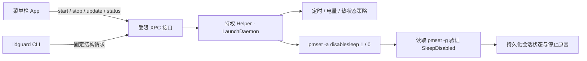

<div align="center">

**简体中文** · [English](README.md)

# LidGuard · 合盖守护

**合盖后让 Mac 继续运行，使 Codex 任务、手机远控等不中断。**

[](https://github.com/aermin/LidGuard)
[](https://github.com/aermin/LidGuard)
[](https://github.com/aermin/LidGuard)
[](https://github.com/aermin/LidGuard)

菜单栏 App · 定时、低电量和热状态保护 · CLI · 不创建虚拟显示器 · 不安装 Agent hooks

</div>

macOS 默认会在合盖后进入睡眠，正在运行的 Codex 任务、构建、下载等后台工作，以及手机远控会随之中断。LidGuard 提供两个明确模式，并可在定时结束、低电量或 macOS 报告严重热压力时自动恢复正常休眠。

- **合盖运行**：合盖后继续运行 Codex 任务和其他后台工作，并让受支持的远程控制软件保持可用。
- **正常休眠**：恢复 macOS 默认行为，合盖后正常进入睡眠。

LidGuard 只改变合盖休眠行为。它不会创建虚拟显示器、捕获屏幕、阻止显示器休眠或修改其他睡眠设置。

> [!WARNING]
> 在保护套、背包或其他密闭空间内运行 MacBook 可能积热。LidGuard 可以响应 macOS 报告的热压力，但无法保证温度或通风一定安全。完全手动且不限时运行需要二次确认。

## 快速开始

### 安装 Preview 预览版

1. 从 [GitHub Releases](https://github.com/aermin/LidGuard/releases) 下载 `LidGuard-1.0.0-preview.1-arm64.dmg`。
2. 打开 DMG，将 **LidGuard** 拖入 **Applications（应用程序）**。
3. 启动 LidGuard，点击 **“安装 Helper”**，并完成一次管理员授权。

安装 Helper 时会同时安装 LaunchDaemon 和 `lidguard` CLI。完成首次授权后，日常切换“合盖运行 / 正常休眠”不再需要管理员密码。

> [!NOTE]
> 当前预览版使用临时签名。如果 macOS 首次启动时拦截，请在“应用程序”中右键 LidGuard，选择 **“打开”** 并确认一次。后续 Developer ID 签名并完成公证的正式版将不需要这一步。

### 日常使用

1. 点击菜单栏中的 LidGuard 图标。
2. 选择 **“合盖运行”**，设置保护策略和运行时长，然后点击 **“开始合盖运行”**。
3. 不再需要持续运行时，选择 **“正常休眠”**，恢复 macOS 默认行为。

运行期间可以随时查看剩余时间、电量、供电方式和热状态，也可以调整当前会话的保护策略。

### 环境

- Apple Silicon Mac
- macOS 13 或更高版本

### 从源码构建

源码构建需要 Xcode Command Line Tools 和 Swift 5.10。

```bash
git clone https://github.com/aermin/LidGuard.git
cd LidGuard

make test
make package
make install
```

`make install` 会：

1. 构建 `dist/LidGuard.app`。
2. 请求一次管理员授权。
3. 安装特权 helper、LaunchDaemon 和 `/usr/local/bin/lidguard`。
4. 打开 LidGuard 菜单栏 App。

完成首次安装后，日常切换模式不再需要管理员授权。

开发版本使用临时签名，每次重新构建都会改变 App 的代码签名。因此执行 `make install` 更新开发版本时，系统会再次请求管理员授权。如果已安装的 helper 不再识别重新构建的 App，LidGuard 会显示 **“重新授权 Helper”**，而不是误报 helper 丢失。

生成本机测试 DMG：

```bash
make dmg
```

产物为 `dist/LidGuard-1.0.0-arm64.dmg`，本机测试 DMG 使用临时签名。

维护者安装 **Developer ID Application** 证书，并将公证凭据保存为 `notarytool` 钥匙串配置后，可以生成正式签名并完成 Apple 公证的发布版本：

```bash
xcrun notarytool store-credentials LidGuard

SIGNING_IDENTITY="Developer ID Application: Your Name (TEAMID)" \
NOTARY_PROFILE="LidGuard" \
make release
```

`make release` 会依次签名 CLI、helper、App 和 DMG，提交 Apple 公证，并将公证票据附加到 DMG。

## 界面

<p align="center">
  
</p>

<p align="center"><sub>完整展开面板：模式选择、设备状态、会话详情、保护策略、运行时长和低电量阈值集中在一个菜单中。</sub></p>

低电量阈值可直接在保护策略面板中调整：严格模式固定为 30%，平衡模式可在 10%–50% 间选择，完全手动模式开启低电量保护后使用同一阈值控件。

<table>
  <tr>
    <td align="center"><strong>合盖运行</strong></td>
    <td align="center"><strong>正常合盖休眠</strong></td>
  </tr>
  <tr>
    <td></td>
    <td></td>
  </tr>
  <tr>
    <td>显示当前策略、时长、低电量阈值、热状态和供电方式。</td>
    <td>保持简洁的待机状态，只在需要时展开会话配置。</td>
  </tr>
</table>

## 三种保护策略

| 策略 | 时长 | 低电量保护 | 热状态保护 | 适合场景 |
| --- | --- | --- | --- | --- |
| **严格** | 必须设置：30 分钟至 8 小时 | 固定 30% | `serious` / `critical` 时恢复正常休眠 | 临时离开，安全优先 |
| **平衡** | 预设、自定义或不限时 | 默认 20%，可调 10%–50% | `serious` / `critical` 时恢复正常休眠 | 日常远控和 Agent 任务 |
| **完全手动** | 预设、自定义或不限时 | 默认关闭，可手动启用 | `serious` 时警告，`critical` 时始终恢复休眠 | 希望直接控制策略的高级用户 |

定时会话最长 7 天；结束前 5 分钟发送通知。低电量保护只在电池供电且未充电时生效。

## CLI

### 安装 CLI

在 App 中点击 **“安装 Helper”** 时会自动安装 CLI。源码构建也可以通过以下命令安装相同组件：

```bash
git clone https://github.com/aermin/LidGuard.git
cd LidGuard
make install
```

`make install` 会同时安装菜单栏 App、特权 helper 和 CLI，并将 CLI 放到：

```text
/usr/local/bin/lidguard
```

安装完成后可以这样确认：

```bash
command -v lidguard
lidguard doctor
lidguard status
```

如果终端提示 `command not found`，先直接执行 `/usr/local/bin/lidguard doctor`。若直接执行可用，请确认 shell 的 `PATH` 包含 `/usr/local/bin`。

> [!NOTE]
> 不要单独从构建目录复制 CLI。它必须与 helper 一同安装，安装器才能登记 CLI 的代码签名要求；更新源码版本时也应重新执行 `make install`。

### 使用

```bash
# 查看当前模式、供电、热状态和保护策略
lidguard status
lidguard status --json

# 启动 4 小时的平衡模式会话
lidguard start --profile balanced --for 4h

# 启动在指定时间结束的严格模式会话
lidguard start --profile strict --until 2026-08-10T23:30:00+08:00

# 启动不限时的完全手动会话，并显式确认风险
lidguard start --profile manual --unlimited --confirm-risk

# 在当前结束时间基础上延长 2 小时
lidguard extend --for 2h

# 立即恢复正常合盖休眠
lidguard stop

# 检查 helper、协议、CLI 和 SleepDisabled
lidguard doctor
```

LidGuard 有意不安装 Codex hooks。Agent 可以显式调用 CLI，但任务开始或结束绝不会自动改变整台 Mac 的系统级睡眠行为。

## 为什么做 LidGuard

通用防休眠工具通常会同时阻止显示器休眠、系统空闲休眠，或两者都阻止。远程控制和 Agent 场景更适合边界更窄、恢复行为可预期的控制方式：

| 目标 | LidGuard 的处理 |
| --- | --- |
| 合盖后任务继续执行 | 只切换系统 `SleepDisabled` 状态 |
| 避免干扰远程桌面输出 | 不创建显示器防休眠断言或虚拟显示器 |
| App 退出后保护仍生效 | LaunchDaemon helper 持久化会话及其策略 |
| 不想每次输入管理员密码 | 首次安装 helper 时授权一次，之后使用受限 XPC 接口 |
| 发生低电量或热压力 | 恢复 `disablesleep=0` 并记录原因 |
| 尊重其他工具的状态修改 | 不反复覆盖；结束会话或标记为外部管理状态 |

## 安全边界

- Helper 运行于 root，但只暴露一组固定的结构化操作。
- Helper 校验调用者的 UID 和安装时记录的代码签名要求。
- App、CLI 和 helper 重启后，会话状态、截止时间和保护策略仍可恢复。
- “恢复正常休眠”只执行 `disablesleep=0`，不会覆盖其他 `pmset` 设置。
- 外部程序清除 `SleepDisabled` 时，LidGuard 结束当前会话，不会反复重新设置。
- 外部程序设置 `SleepDisabled` 时，界面会提示当前状态不由 LidGuard 管理。
- 卸载 helper 前会先恢复正常休眠。

## 验证

自动测试覆盖策略矩阵、定时解析、低电量、macOS 四级热状态、状态恢复、外部覆盖和 `pmset` 验证失败。测试使用模拟的电源控制器与传感器，不会修改真实系统电源状态。

```text
Tests: 16 passed, 0 failed
```

当前开发机已验证：

- 合盖运行时，vivo 远控保持可见、可操作，本地编程 Agent 继续执行。
- 正常休眠时，合盖后远控不可操作，macOS 按默认行为进入睡眠。
- App 退出后，helper 仍能执行定时、低电量和热状态保护。
- LidGuard 不启动 `caffeinate` 进程，也不创建显示器防休眠断言。

## 卸载

在 App 设置中选择 **“恢复休眠并卸载 Helper”**。该操作会先恢复 `disablesleep=0`，再删除 LaunchDaemon、helper 和 CLI；App 本体和源码目录会保留。

## 已知限制

> [!IMPORTANT]
> Apple 没有将 `pmset disablesleep` 作为稳定的公开接口提供文档。每次升级 macOS 后，都应重新验证合盖、唤醒和远程控制行为。

- LidGuard 读取 `ProcessInfo.thermalState` 报告的系统热压力等级，不读取私有 SMC 摄氏温度。

## 项目结构

```text
LidGuardCore       共享模型、策略、时间解析和 XPC 协议
LidGuardApp        SwiftUI 菜单栏 App 与设置页
LidGuardHelper     特权 helper 可执行程序
LidGuardHelperKit  电源控制、传感器、状态持久化和策略引擎
LidGuardCLI        lidguard 命令行工具
LidGuardTests      无副作用的策略与 helper 测试
```

## 工作原理


